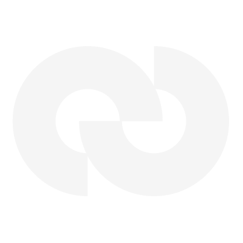

# Cashmere Labs Brand Kit

<p align="center">
  
</p>

<p align="center">
  <strong>Official brand assets for Cashmere Labs</strong>
</p>

---

## Overview

This repository contains the official brand assets for Cashmere Labs. All assets are designed to maintain brand consistency across all platforms and applications. Please follow the guidelines below to ensure proper usage.

## 📁 Repository Structure

```
cashmere-brand-kit/
├── cashmere-logos/          # Logo files in various formats and sizes
│   ├── Dark/                # Dark version logos (for light backgrounds)
│   └── Light/               # Light version logos (for dark backgrounds)
├── cashmere-font/           # Typography assets
│   └── Geist/               # Geist variable font files
├── cashmere-color-palette/  # Color specification reference
└── cashmere-motion/         # Animated logo assets
```

---

## 🎨 Color Palette

### Primary Colors

| Color Name | Hex Code | Usage |
|------------|----------|-------|
| **Dark Blue** | `#04003E` | Primary brand color. Embodies confidence, trust, and authority. |
| **Light Sky** | `#4683C6` | Represents openness, clarity, and freshness. |

### Neutral Colors

| Color Name | Hex Code | Usage |
|------------|----------|-------|
| **Off-White** | `#F5F5F5` | Primary light background |
| **Off-White Alt** | `#E6E6E6` | Secondary light background |
| **Dark** | `#111111` | Primary dark text/background |
| **Dark Alt 1** | `#141414` | Secondary dark elements |
| **Dark Alt 2** | `#252525` | Tertiary dark elements |
| **Dark Alt 3** | `#4C4C4C` | Quaternary dark elements |

### CSS Variables

```css
:root {
  /* Primary */
  --cashmere-dark-blue: #04003E;
  --cashmere-light-sky: #4683C6;
  
  /* Neutrals - Light */
  --cashmere-off-white: #F5F5F5;
  --cashmere-off-white-alt: #E6E6E6;
  
  /* Neutrals - Dark */
  --cashmere-dark: #111111;
  --cashmere-dark-alt-1: #141414;
  --cashmere-dark-alt-2: #252525;
  --cashmere-dark-alt-3: #4C4C4C;
}
```

---

## ✏️ Typography

### Primary Typeface: Geist

Geist is a modern, versatile sans-serif typeface designed for optimal legibility and sleek visual impact. Its precision letterforms and condensed spacing create a streamlined, contemporary look.

**Available Weights:**
- Thin (100)
- ExtraLight (200)
- Light (300)
- Regular (400)
- Medium (500)
- SemiBold (600)
- Bold (700)
- ExtraBold (800)
- Black (900)

### Font Files

| File | Description |
|------|-------------|
| `Geist-VariableFont_wght.ttf` | Variable font (recommended) |
| `static/Geist-*.ttf` | Individual weight files |

### CSS Implementation

```css
@font-face {
  font-family: 'Geist';
  src: url('path/to/Geist-VariableFont_wght.ttf') format('truetype');
  font-weight: 100 900;
  font-style: normal;
}

body {
  font-family: 'Geist', sans-serif;
}
```

---

## 🖼️ Logo Assets

### Available Formats

| Format | Use Case |
|--------|----------|
| **SVG** | Web, scalable applications, print |
| **PNG** | Digital use, presentations, documents |

### Size Variations

- **32px** — Favicons, small UI elements
- **100px** — Standard UI components
- **200px** — Headers, larger UI elements  
- **400px** — Hero sections, print materials

### Logo Types

| Type | Description |
|------|-------------|
| **Logo** | Symbol mark only |
| **Logotype** | Symbol mark with wordmark |

### Version Selection Guide

| Background | Use Version |
|------------|-------------|
| Light backgrounds | `Dark/` folder assets |
| Dark backgrounds | `Light/` folder assets |

### Quick Reference

```
Dark/
├── Cashmere-logo-{size}.{png|svg}      # Dark symbol mark
└── Cashmere-logotype-{size}.{png|svg}  # Dark symbol + wordmark

Light/
├── Cashmere-logo-{size}.{png|svg}      # Light symbol mark
└── Cashmere-logotype-{size}.{png|svg}  # Light symbol + wordmark
```

---

## 🎬 Motion Assets

Animated logo assets for video, presentations, and dynamic applications.

| File | Format | Description |
|------|--------|-------------|
| `Cashmere-Logo-Animated.mov` | MOV | High-quality video file |
| `Cashmere-Logo-04_3_optimized.gif` | GIF | Optimized animated GIF |
| `Cashmere-Logo-04_4_optimized.gif` | GIF | Optimized animated GIF (alt) |

---

## 📋 Usage Guidelines

### Do's ✅

- Use official assets from this repository
- Maintain proper contrast between logo and background
- Use SVG format when possible for crisp rendering
- Respect minimum clear space around the logo
- Use designated color values for brand consistency

### Don'ts ❌

- Do not alter logo colors outside brand palette
- Do not stretch, distort, or rotate the logo
- Do not add effects (shadows, glows, gradients)
- Do not place logo on busy or low-contrast backgrounds
- Do not recreate the logo using other fonts

---

## 📄 License

### Font License
The Geist font is licensed under the [SIL Open Font License (OFL)](cashmere-font/Geist/OFL.txt). You are free to use, modify, and redistribute the font in your products and projects.

### Brand Assets
All Cashmere Labs brand assets (logos, color palette, motion graphics) are proprietary and should only be used in accordance with Cashmere Labs brand guidelines. For permission requests or inquiries, please contact the brand team.

---

## 📞 Contact

For brand-related inquiries, asset requests, or usage permissions, please reach out to the contact@cashmere.exchange.

---

<p align="center">
  <sub>© Cashmere Labs. All rights reserved.</sub>
</p>
